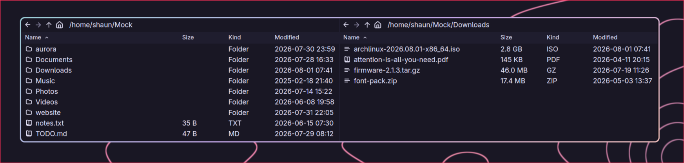

# hoja

hoja is a file manager for Linux. It runs on Wayland. It uses
[GPUI](https://www.gpui.rs/), the GPU-accelerated UI framework from the Zed
editor.

*Hoja* is Spanish for a sheet of paper and for a pane of glass. The program
shows files in panes, so the word says both halves of it.

**Warning:** hoja is experimental software. Do not use hoja as your only tool
for important data.



## Features

### The panes

- **Panes.** Split the window into panes. Each pane shows one directory. The
  split tree is recursive, in the same shape as the Zed editor.
- **Fast lists.** A pane shows a directory of 100,000 files in less than one
  second. The list stays smooth when you scroll.
- **Navigation.** Each pane has its own history. Use the back, forward, up, and
  home buttons. Click the path, then type a new path.
- **The active pane.** The pane your keys act on keeps the full text colour.
  The others drop to the muted colour and hold their selection at half
  strength, so two panes with selections cannot be mistaken for each other.
- **View settings.** Each pane has a menu at the right end of the toolbar.
  It controls hidden files, folder grouping, and the sort order. hoja does
  not show hidden files by default.
- **Live listings.** hoja watches the directory it shows. If another program
  adds, removes, or changes a file, the pane re-lists and keeps your selection.
  If the directory itself goes away, the pane moves to the nearest directory
  above it that still exists and tells you.

### Moving files

- **File transfer.** hoja selects the fastest correct method for each file:
  - A move on one filesystem uses `rename()`. This is instant.
  - A copy on btrfs or XFS uses reflink. This is instant for all file sizes.
  - All other copies use `copy_file_range` with a fallback. Sparse files stay
    sparse.
  - hoja keeps permissions, times, extended attributes, symlinks, and
    hardlinks. Writes are atomic. On removable media, hoja flushes data before
    it reports success.
- **Delete with undo.** `delete` removes the selection and `ctrl-z` puts it
  back. hoja moves the files to the trash directory of the freedesktop
  specification, on the same filesystem, so a delete is instant and other
  file managers can empty what hoja deletes. hoja has no other trash
  controls: no browser, no restore list, no empty command.
- **Drag and drop.** Drag rows to another pane, onto a folder, or to another
  application. Drag files from another application into a pane. A drag moves
  the files on one filesystem and copies them across filesystems, which is the
  usual behaviour. Hold `ctrl` to copy or `shift` to move. Files that come from
  another application are always copied.
- **Clipboard.** Copy and paste files between hoja and other file managers.
  hoja reads and writes the GNOME clipboard format.
- **Transfer progress.** The bar along the bottom shows how far a transfer has
  got, how fast it is going, and how much longer it has: `365 MB / 680 MB ·
  82 MB/s · 4s left`. hoja counts the files before it starts copying, so the
  bar is true from the first file rather than jumping at the end.
- **Notifications.** A transfer that runs for more than a few seconds tells
  your desktop when it finishes, and a failed one tells you whatever its
  length. hoja uses the freedesktop notification service, so the notification
  looks like every other notification on your desktop.

### Finding things

- **Search.** Press `ctrl-f` and type. hoja searches every folder below the one
  the pane shows and lists what it finds, with the path of each result. Results
  appear while the search runs. Press enter to go back to the list, then enter
  again to open. Press escape to stop searching.
- **Places.** Press `ctrl-p` to go to your home directory, a bookmark, or an
  attached drive. hoja reads the same bookmarks file the GTK file dialogs use,
  so what you bookmark in Files appears here with no setup. A drive that is
  plugged in but not mounted is listed too; choosing it mounts the drive first.
- **Command palette.** Press `ctrl-shift-p`, type part of a command name, and
  press enter. The list shows only the commands that apply right now, with
  their keys. Commands you use often move to the top.

### How it looks

- **Git status.** In a git repository, the colour of a file name shows its
  status: added, modified, deleted, renamed, or in conflict. A folder shows
  the status of the files in it. Ignored files are dim. hoja asks `git`
  itself, so the result always agrees with the command line.
- **Themes.** hoja reads Zed theme files. Put a theme file in
  `~/.config/hoja/themes/`. hoja applies changes to these files immediately.
  The Rosé Pine themes are included.
- **Icons.** File icons follow the Zed icon system. The theme sets the icon
  color.
- **Settings.** `~/.config/hoja/settings.json` sets the theme and what a new
  pane shows. hoja never writes this file, so your comments and your layout
  stay. It applies changes to the file immediately.

## Install

On Arch Linux, build the package from `packaging/`:

```sh
cd packaging && makepkg -si
```

It builds from the current `main`, since there are no releases yet.

## Start

```sh
hoja [DIRECTORY] [--theme NAME] [--list-themes]
```

The `HOJA_THEME` environment variable also sets the theme.

## Settings

Write `~/.config/hoja/settings.json`. Every field is optional, comments are
allowed, and hoja applies a change as soon as you save.

```jsonc
{
  // A theme in ~/.config/hoja/themes/, or a bundled Rosé Pine variant.
  "theme": "Rosé Pine Moon",

  // What a new pane shows.
  "view": {
    "sort": { "key": "name", "direction": "ascending" },
    "show_hidden": false,
    "folders_first": true
  }
}
```

`--theme` on the command line, then `$HOJA_THEME`, then this file.

hoja keeps what you change through the interface — the sort order, hidden
files, and the column widths you drag — in `~/.local/state/hoja/state.json`,
and reads it back at the next start. It writes that file and you write the
other one, so neither can overwrite the other. When both have an answer, the
more recent one applies: what you last toggled survives a restart, and editing
the settings file takes effect over it.

Two hoja windows share that file safely. Each one writes only the settings you
changed in it, so a change made in one window is not undone by the other.

## Keys

Keys work on the pane that has focus.

**Move**

| Key | Function |
|---|---|
| `↑` `↓` | Move the selection one row |
| `pageup` `pagedown` | Move the selection one screen |
| `home` `end` | Move to the first or the last entry |
| `enter` | Open the selected entry |
| type a name | Jump to the first match. Repeat one letter to cycle the matches. |
| `alt-←` `alt-→` | Go back and forward in the history |
| `alt-↑` or `backspace` | Go to the parent directory |
| `alt-home` | Go to the home directory |
| `ctrl-l` | Edit the path |
| `ctrl-f` | Search this folder and everything below it |

**Select**

An outline marks the entry that the keys act on. It is usually also selected.
Use `ctrl` with the movement keys to move the outline alone, and `ctrl-space`
to add or remove that one entry. This builds a selection of entries that are
not next to each other.

| Key | Function |
|---|---|
| `shift-↑` `shift-↓` | Extend the selection one row |
| `shift-pageup` `shift-pagedown` | Extend the selection one screen |
| `shift-home` `shift-end` | Extend the selection to the first or the last entry |
| `ctrl-↑` `ctrl-↓` | Move the outline and keep the selection |
| `ctrl-space` | Add or remove the outlined entry |
| `ctrl-a` | Select all |
| `escape` | Stop searching, or clear the selection |

**Change files**

| Key | Function |
|---|---|
| `f2` | Rename the selected entry |
| `delete` | Delete the selection |
| `ctrl-z` | Undo the last delete |
| `ctrl-c` `ctrl-x` `ctrl-v` | Copy, cut, paste |

**Panes and view**

To split in another direction, or to move to the pane above or to the left,
open the command palette and type the name. These commands are not on a key
because they are rare.

| Key | Function |
|---|---|
| `tab` / `shift-tab` | Move to the next or the previous pane |
| `f3` | Split the active pane |
| `ctrl-w` | Close the active pane |
| `ctrl-h` | Show or hide hidden files |
| `ctrl-shift-d` | Dismiss finished transfers |
| `ctrl-shift-p` | Open the command palette |
| `ctrl-p` | Go to a place: home, a bookmark, or a drive |

**Mouse**

| Action | Function |
|---|---|
| Click | Select the row |
| `ctrl`-click | Add or remove one row |
| `shift`-click | Select a range |
| Double-click | Open the entry |
| Right-click | Open the context menu |
| Click a column header | Sort. Click again to reverse the order. |
| Drag a header divider | Resize the column |
| Click the magnifier | Start or stop a search |
| Drag rows | Move them. Across filesystems, hoja copies them. |
| `ctrl`-drag / `shift`-drag | Always copy / always move |
| Drop on a folder row | Put the files in that folder |
| Back and forward buttons | Go back and forward in the history |

**While you edit a path**

| Key | Function |
|---|---|
| `←` `→` or `ctrl-←` `ctrl-→` | Move one character or one word |
| `home` `end` | Move to the start or the end |
| add `shift` | Extend the selection instead |
| `ctrl-backspace` `ctrl-delete` | Delete one word |
| `enter` or `escape` | Go to the path, or cancel |

**In a menu, a dialog, or the command palette**

| Key | Function |
|---|---|
| `↑` `↓` | Move the highlight |
| `enter` or `escape` | Choose, or close |

## Build

1. Install Rust 1.95 or later. The Zed source sets this minimum.
2. On Arch Linux, install these packages:
   `clang cmake pkgconf fontconfig freetype2 wayland wayland-protocols
   libxkbcommon libxkbcommon-x11 vulkan-icd-loader alsa-lib openssl zstd`
3. Run `cargo build --release`.

Note: Cargo compiles GPUI with your local toolchain. The toolchain file in the
Zed repository does not apply to git dependencies.

## Transfer engine

The `hoja-transfer` crate contains the transfer engine. It is a standard
Rust library with no UI dependencies. One worker thread does each job. The UI
reads progress from atomic counters.

To run the engine tests:

```sh
cargo test -p hoja-transfer
```

The reflink test needs a btrfs filesystem. To prepare one:

```sh
./scripts/btrfs-loop.sh up
HOJA_TEST_BTRFS=/tmp/hoja-btrfs/mnt cargo test -p hoja-transfer -- --ignored
```

## Roadmap

These features are planned and not complete:

- Parallel copy for many small files
- A job journal, for undo of a transfer and resume after a crash
- A relative time option for the Modified column, such as "2 hours ago"
- Optional columns for the owner, the group, and the permissions
- Tabs, previews, and thumbnails
- Delta sync between machines

See [`docs/transfer-plan.md`](docs/transfer-plan.md) for the full design.

## License

The license of hoja is GPL-3.0-or-later. See the `LICENSE` file.

GPUI has the Apache-2.0 license. The Zed `theme` and `file_icons` crates have
the GPL-3.0-or-later license. This is why hoja uses the GPL.

The included assets have their own licenses:

- The icons come from Lucide and Zed. The license is ISC. See
  `assets/icons/LICENSES`.
- The Rosé Pine themes have the MIT license. See
  `assets/themes/rose-pine/LICENSE`.
