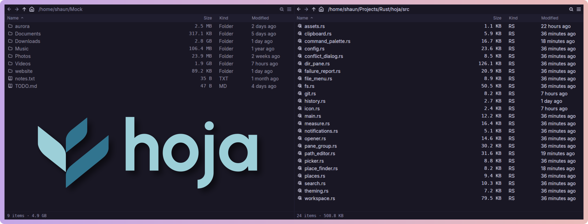

[](https://www.gpui.rs/)

**Hoja** (OH-hah) is a file manager for Linux. It runs on Wayland and renders
via [GPUI](https://www.gpui.rs/), the GPU-accelerated framework from the Zed
editor. It features recursive pane layouts, background folder size
calculation, optimized file transfers, undoable deletes, live directory
updates, and archive browsing that feels like working with ordinary folders.

> [!WARNING]
> Hoja is experimental software. Use at your own risk.

## Features

### Panes

- **Recursive pane layout.** Split the window into panes. Each pane shows one
  directory, and panes can be split recursively into any layout.
- **Fast directory listings.** Rows are virtualized, so even very large
  directories stay smooth while scrolling.
- **Independent navigation.** Every pane has its own history. Go back,
  forward, up, or home, or click the path to jump to another location.
- **Recursive folder sizes.** Folder sizes are calculated in the background
  and appear only when complete, so values never count upward in the listing.
  Sorting by size happens once, after every folder has a final value.
- **Pane footer.** Each pane summarizes exactly what it contains: total items
  and size, selected files, permissions and ownership for a single file, or
  live search progress.
- **Clear active pane.** The active pane keeps full emphasis while inactive
  panes dim their names, icons, paths, and selections. Git status colours are
  preserved.
- **Per-pane view settings.** Hidden files, folder grouping, and sort order
  are configured independently for each pane. Hidden files are off by
  default.
- **Archives as folders.** Browse `.zip`, `.tar`, `.tar.gz`, `.tar.bz2`,
  `.tar.xz`, and `.tar.zst` archives like directories. Tar archives stream
  while loading so files appear immediately, and archive folders report their
  recursive sizes instantly. Copy files out using the keyboard, context menu,
  or drag and drop. Archives are always read-only.
- **Live listings.** Hoja watches every directory it displays. If another
  program changes the contents, the pane refreshes without losing your
  selection. If the directory disappears, Hoja moves to the nearest existing
  parent.

### File operations

- **Optimized transfers.** Hoja automatically chooses the fastest correct
  method for every transfer: `rename()` for moves on the same filesystem,
  reflinks on supported filesystems, and `copy_file_range()` elsewhere with
  fallbacks. Sparse files, permissions, timestamps, extended attributes,
  symlinks, and hardlinks are preserved.
- **Undo.** Press `ctrl-z` to take back the last thing you did, whether that
  was a delete or a transfer. `delete` moves files to the freedesktop trash,
  which is instant on the same filesystem and compatible with other Linux file
  managers. Undoing a transfer removes what it copied and restores anything it
  replaced. It checks first: a file edited since the transfer is left alone
  and reported, and what it removes goes to the trash rather than being
  deleted, so an undo can itself be undone.
- **Drag and drop.** Drag files between panes, onto folders, or into other
  applications. Moves stay on one filesystem, copies cross filesystems, and
  modifier keys override the default behaviour.
- **Clipboard integration.** Copy and paste files between Hoja and other file
  managers using the standard GNOME clipboard format.
- **Transfer progress.** Progress reports bytes copied, transfer speed, time
  remaining, and file counts from the start of the operation. Fixed-width
  columns keep everything from shifting while values change.
- **Transfer errors.** Failed transfers stay in the progress list with a
  warning. Open the details to see every failed file and its error.
- **Pause and resume.** Every transfer has a pause control, and
  `ctrl-shift-space` stops or starts them all. A transfer pauses between
  files, so one already in flight finishes first; the row says `pausing…`
  until it has actually stopped.
- **Interrupted transfers.** If Hoja is killed partway through a transfer, the
  next start clears up the half-written files it left and offers to finish
  what it had not done.
- **Desktop notifications.** Long-running transfers notify you when they
  finish, and failures always generate a notification using the standard
  freedesktop notification service.

### Navigation & search

- **Recursive search.** Press `ctrl-f` to search every directory below the
  current one. Results appear as they are found, and pressing `enter` opens
  the selected result. It works inside an archive too, where there is nothing
  to walk: the member list the pane already read answers immediately, and
  results keep arriving if the archive is still being read. Each result is
  labelled by where it sits, and copying one out keeps the structure below the
  folder you searched.
- **Places.** Press `ctrl-p` to jump to your home directory, bookmarks, or
  attached drives. Hoja reads the same bookmarks used by GTK file dialogs and
  can mount or eject removable drives.
- **Command palette.** Press `ctrl-shift-p` to search available commands.
  Frequently used commands naturally rise to the top.

### Appearance

- **Human-friendly dates.** The Modified column shows relative times such as
  `just now`, `3 hours ago`, or `2 months ago`.
- **Git status.** File names are coloured by Git status, including folders,
  using Git's own status information so Hoja always matches the command
  line.
- **Themes.** Hoja reads Zed theme files from `~/.config/hoja/themes/` and
  reloads them automatically. Rosé Pine themes are included.
- **Icons.** File icons follow the Zed icon system and inherit colours from
  the active theme.
- **Settings.** Configure Hoja with `~/.config/hoja/settings.json`. Hoja
  never rewrites the file, preserves your comments, and reloads changes
  automatically.

## Install

On Arch Linux, build the package from `packaging/`:

```sh
cd packaging && makepkg -si
```

It builds from the current `main`, since there are no releases yet.

## Start

```sh
hoja [DIRECTORY] [--theme NAME] [--list-themes]
```

The `HOJA_THEME` environment variable also sets the theme.

## Settings

Write `~/.config/hoja/settings.json`. Every field is optional, comments are
allowed, and Hoja applies a change as soon as you save.

```jsonc
{
  // A theme in ~/.config/hoja/themes/, or a bundled Rosé Pine variant.
  "theme": "Rosé Pine Moon",

  // What a new pane shows.
  "view": {
    "sort": { "key": "name", "direction": "ascending" },
    "show_hidden": false,
    "folders_first": true
  }
}
```

`--theme` on the command line, then `$HOJA_THEME`, then this file.

Hoja keeps what you change through the interface (the sort order, hidden
files, and the column widths you drag) in `~/.local/state/hoja/state.json`,
and reads it back at the next start. It writes that file and you write the
other one, so neither can overwrite the other. When both have an answer, the
more recent one applies: what you last toggled survives a restart, and editing
the settings file takes effect over it.

Two Hoja windows share that file safely. Each one writes only the settings you
changed in it, so a change made in one window is not undone by the other.

## Keys

Keys work on the pane that has focus.

#### Move

| Keys | Action |
| :-- | :-- |
| <kbd>↑</kbd> / <kbd>↓</kbd> | Move the selection one row |
| <kbd>Page Up</kbd> / <kbd>Page Down</kbd> | Move the selection one screen |
| <kbd>Home</kbd> / <kbd>End</kbd> | Move to the first or the last entry |
| <kbd>Enter</kbd> | Open the selected entry. A folder or a `.zip` opens in the pane. |
| Type a name | Jump to the first match. Repeat one letter to cycle the matches. |
| <kbd>Alt</kbd> + <kbd>←</kbd> / <kbd>Alt</kbd> + <kbd>→</kbd> | Go back and forward in the history |
| <kbd>Alt</kbd> + <kbd>↑</kbd> / <kbd>Backspace</kbd> | Go to the parent directory |
| <kbd>Alt</kbd> + <kbd>Home</kbd> | Go to the home directory |
| <kbd>Ctrl</kbd> + <kbd>L</kbd> | Edit the path |
| <kbd>Ctrl</kbd> + <kbd>F</kbd> | Search this folder and everything below it |

#### Select

An outline marks the entry that the keys act on. It is usually also selected.
Use <kbd>Ctrl</kbd> with the movement keys to move the outline alone, and
<kbd>Ctrl</kbd> + <kbd>Space</kbd> to add or remove that one entry. This builds
a selection of entries that are not next to each other.

| Keys | Action |
| :-- | :-- |
| <kbd>Shift</kbd> + <kbd>↑</kbd> / <kbd>Shift</kbd> + <kbd>↓</kbd> | Extend the selection one row |
| <kbd>Shift</kbd> + <kbd>Page Up</kbd> / <kbd>Shift</kbd> + <kbd>Page Down</kbd> | Extend the selection one screen |
| <kbd>Shift</kbd> + <kbd>Home</kbd> / <kbd>Shift</kbd> + <kbd>End</kbd> | Extend the selection to the first or the last entry |
| <kbd>Ctrl</kbd> + <kbd>↑</kbd> / <kbd>Ctrl</kbd> + <kbd>↓</kbd> | Move the outline and keep the selection |
| <kbd>Ctrl</kbd> + <kbd>Space</kbd> | Add or remove the outlined entry |
| <kbd>Ctrl</kbd> + <kbd>A</kbd> | Select all |
| <kbd>Escape</kbd> | Stop searching, or clear the selection |

#### Change files

| Keys | Action |
| :-- | :-- |
| <kbd>F2</kbd> | Rename the selected entry |
| <kbd>Delete</kbd> | Delete the selection |
| <kbd>Ctrl</kbd> + <kbd>Z</kbd> | Undo the last delete or transfer |
| <kbd>Ctrl</kbd> + <kbd>C</kbd> / <kbd>Ctrl</kbd> + <kbd>X</kbd> / <kbd>Ctrl</kbd> + <kbd>V</kbd> | Copy, cut, paste |

#### Panes and view

To split in another direction, or to move to the pane above or to the left,
open the command palette and type the name. These commands are not on a key
because they are rare.

| Keys | Action |
| :-- | :-- |
| <kbd>Tab</kbd> / <kbd>Shift</kbd> + <kbd>Tab</kbd> | Move to the next or the previous pane |
| <kbd>F3</kbd> | Split the active pane |
| <kbd>Ctrl</kbd> + <kbd>W</kbd> | Close the active pane |
| <kbd>Ctrl</kbd> + <kbd>H</kbd> | Show or hide hidden files |
| <kbd>Ctrl</kbd> + <kbd>Shift</kbd> + <kbd>D</kbd> | Dismiss finished transfers |
| <kbd>Ctrl</kbd> + <kbd>Shift</kbd> + <kbd>Space</kbd> | Pause or resume every transfer |
| <kbd>Ctrl</kbd> + <kbd>Shift</kbd> + <kbd>P</kbd> | Open the command palette |
| <kbd>Ctrl</kbd> + <kbd>P</kbd> | Go to a place: home, a bookmark, or a drive |
| <kbd>Ctrl</kbd> + <kbd>E</kbd> | In that list, eject the highlighted drive |

#### Mouse

| Mouse | Action |
| :-- | :-- |
| Click | Select the row |
| <kbd>Ctrl</kbd> + Click | Add or remove one row |
| <kbd>Shift</kbd> + Click | Select a range |
| Double-click | Open the entry |
| Right-click | Open the context menu |
| Click a column header | Sort. Click again to reverse the order. |
| Drag a header divider | Resize the column |
| Click the magnifier | Start or stop a search |
| Drag rows | Move them. Across filesystems, Hoja copies them. |
| <kbd>Ctrl</kbd> + Drag / <kbd>Shift</kbd> + Drag | Always copy / always move |
| Drop on a folder row | Put the files in that folder |
| Back and forward buttons | Go back and forward in the history |

#### While you edit a path

| Keys | Action |
| :-- | :-- |
| <kbd>←</kbd> / <kbd>→</kbd> / <kbd>Ctrl</kbd> + <kbd>←</kbd> / <kbd>Ctrl</kbd> + <kbd>→</kbd> | Move one character or one word |
| <kbd>Home</kbd> / <kbd>End</kbd> | Move to the start or the end |
| add <kbd>Shift</kbd> | Extend the selection instead |
| <kbd>Ctrl</kbd> + <kbd>Backspace</kbd> / <kbd>Ctrl</kbd> + <kbd>Delete</kbd> | Delete one word |
| <kbd>Enter</kbd> / <kbd>Escape</kbd> | Go to the path, or cancel |

#### In a menu, a dialog, or the command palette

| Keys | Action |
| :-- | :-- |
| <kbd>↑</kbd> / <kbd>↓</kbd> | Move the highlight |
| <kbd>Enter</kbd> / <kbd>Escape</kbd> | Choose, or close |

## Build

1. Install Rust 1.95 or later. The Zed source sets this minimum.
2. On Arch Linux, install these packages:
   `clang cmake pkgconf fontconfig freetype2 wayland wayland-protocols
   libxkbcommon libxkbcommon-x11 vulkan-icd-loader alsa-lib openssl zstd`
3. Run `cargo build --release`.

Note: Cargo compiles GPUI with your local toolchain. The toolchain file in the
Zed repository does not apply to git dependencies.

## Checks

CI runs on every push and pull request, and the same three commands run
locally:

```sh
cargo fmt --all --check
cargo clippy --workspace --all-targets -- -D warnings
cargo test --workspace
```

Clippy runs again in release, which is the one profile where dead code shows
up differently: a method reached only from a debug assertion is live in one and
not the other.

## Testing the interface

`scripts/sway-harness.sh` runs Hoja in a compositor of its own, so a test of
the interface does not touch the desktop you are using. It takes a directory to
open and a script of things to do, and prints where the screenshots went:

```sh
cargo build
scripts/sway-harness.sh ~/some/dir my-test.sh
```

It needs `sway`, `grim`, `wtype` and `wlrctl`, and it exercises the Wayland
backend Hoja actually ships on. The test script can click rows, send keys, and
capture the window or just its footer; nothing takes your focus, because every
one of those tools is scoped to the nested display rather than to whatever the
real session has focused. `HOJA_TEST_WIDTH` and `HOJA_TEST_HEIGHT` size the
window, which is how `docs/screenshot.png` is made. `HOJA_TEST_HEADLESS=1` hides
it, at the cost of keyboard input, which does not reach the app there.

Nested, its window presents to the host as class `wlroots`, so float it at a
fixed size or a tiling compositor will stretch it and move the rows a test
clicks.

A `wait_for` that times out ends the run. That is a safety property rather
than a tidiness one: once a wait has failed the script no longer knows where
the window is, and everything after it is keystrokes sent somewhere unverified.
An earlier version carried on, walked a pane up to the root of the filesystem
and pressed paste there; nothing was written only because root is not writable.

There are nine suites in `scripts/tests/`. `listing.sh` runs against `~/Mock`;
`archive.sh` and `tar.sh` need fixtures, which `scripts/tests/setup-archives.sh`
builds and prints the path of:

```sh
scripts/sway-harness.sh "$(scripts/tests/setup-archives.sh)" scripts/tests/archive.sh
scripts/sway-harness.sh "$(scripts/tests/setup-archives.sh)" scripts/tests/tar.sh
```

Rebuilt for each, not shared between them: `archive.sh` copies a folder out of
an archive and leaves it in the fixture directory, which is the tenth row
`tar.sh` does not expect. `setup-archives.sh` clears the directory before it
builds, so calling it twice is the whole fix.

`transfer.sh` needs `setup-transfer.sh`, and pauses a transfer by stopping it
on a conflict first: four thousand files copy in about 170ms here, so a test
that raced one would lose.

```sh
XFER=$(scripts/tests/setup-transfer.sh)
scripts/sway-harness.sh "$XFER" scripts/tests/transfer.sh
```

`crash-phase1.sh` and `crash-phase2.sh` are one test in two runs against one
state directory. The harness kills the app when a script returns, which is the
crash; `HOJA_TEST_KEEP_STATE=1` stops the second run wiping what the first
left behind.

```sh
OUT=$(mktemp -d)
scripts/sway-harness.sh "$XFER" scripts/tests/crash-phase1.sh "$OUT"
HOJA_TEST_KEEP_STATE=1 \
    scripts/sway-harness.sh "$XFER" scripts/tests/crash-phase2.sh "$OUT"
```

`resort-while-reading.sh`, `interrupt-archive-read.sh` and
`search-while-reading.sh` all act while an archive is still being read, so they
need a fixture slow enough to act *in*. `setup-slow-archive.sh` builds it, and
is kept separate so a ~15 MB member genuinely slow to read (bzip2, real
pseudo-random content) does not change the row counts the other suites assert
on:

```sh
SLOW=$(scripts/tests/setup-slow-archive.sh)
scripts/sway-harness.sh "$SLOW" scripts/tests/resort-while-reading.sh
scripts/sway-harness.sh "$SLOW" scripts/tests/interrupt-archive-read.sh
scripts/sway-harness.sh "$SLOW" scripts/tests/search-while-reading.sh
```

Two things it cannot do. It cannot synthesise a drag: `wlrctl` only clicks, and
`swaymsg seat - cursor` moves the pointer without gpui starting a drag from it,
so column resizing and drag-and-drop need a person. And it has no second
application to drag from or paste into, so inbound drops and clipboard interop
have to be tried in a real session.

One thing to know if the nested window is sent to another workspace by a rule:
give it `render_unfocused` too. A window nobody is looking at gets no frame
callbacks, so the nested compositor paints nothing, hoja never renders past
its first frame, and every assertion times out against a listing that stays
empty.

`scripts/x11-harness.sh` is kept but does not currently run: `Xvfb` offers no
DRI3, gpui never gets a GPU context, and the window never opens. Testing the
X11 backend needs a real X server.

## Transfer engine

The `hoja-transfer` crate contains the transfer engine. It is a standard
Rust library with no UI dependencies. One worker thread does each job. The UI
reads progress from atomic counters.

Each job also records what it changed, in the form that reverses it, and hands
that back when it finishes. The record stays small because a directory stands
for its contents: copying into a name that held nothing records the directory
and nothing beneath it, and a move within one filesystem is a single rename
however large the tree. Per-file records appear only where a copy merged into
a directory that already existed. Undoing a transfer is itself a job, so it
gets the same progress bar, cancel button and error report as the transfer it
is taking back.

To run the engine tests:

```sh
cargo test -p hoja-transfer
```

The reflink test needs a btrfs filesystem. To prepare one:

```sh
./scripts/btrfs-loop.sh up
HOJA_TEST_BTRFS=/tmp/hoja-btrfs/mnt cargo test -p hoja-transfer -- --ignored
```

## Roadmap

Planned and not complete:

- **Writing to an archive.** Everything here reads; rename, delete and paste
  inside one are refusals rather than half-features.
- **Owner, group and permission columns**, for anyone who wants them.
- **Tabs, previews and thumbnails.**
- **Query history in the pickers**, and modal geometry that persists.
- **Explicit sync between two directories**, chunked so that repeating it moves
  only what changed.
- **Sync between two machines**, Hoja to Hoja.

Planned once, and now in doubt:

- **Parallel copy for many small files.** Measured against `xcp`: 4.7x faster on
  tmpfs, and *slower* than a single thread on real devices. The win was the RAM
  disk rather than the parallelism, so this needs a benchmark that is not a
  tmpfs before it is worth building. What the same measurements did point at is
  the atomic temp-file rename, which was half the time of an exFAT copy.
- **io_uring underneath it**, which was always conditional on that benchmark.

## License

The license of Hoja is GPL-3.0-or-later. See the `LICENSE` file.

GPUI has the Apache-2.0 license. The Zed `theme` and `file_icons` crates have
the GPL-3.0-or-later license. This is why Hoja uses the GPL.

The included assets have their own licenses:

- The icons Hoja's own interface uses are Lucide, under the ISC license. The
  file-type icons are Zed's set, which includes brand and language marks
  belonging to their own projects. See `assets/icons/LICENSES`.
- The Rosé Pine themes have the MIT license. See
  `assets/themes/rose-pine/LICENSE`.
